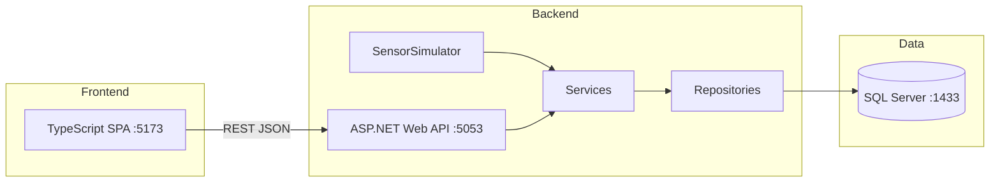

# Building Data Explorer

A mini **digital twin** backend for property management — buildings, rooms, and IoT sensor data (temperature & electricity). Built as a portfolio project mirroring real-estate SaaS domains.

## What it does

- REST API for buildings, rooms, and sensor readings
- **SensorSimulator** — fake IoT data every 30 seconds via `BackgroundService`
- TypeScript frontend with room status colors (hot / cold / normal)
- PowerShell scripts for database setup, seeding, and running locally
- SQL Server in Docker

## Architecture



**Layers:** Controller → Service → Repository → EF Core → SQL Server

## Prerequisites

| Tool | Purpose |
|------|---------|
| [.NET 9 SDK](https://dotnet.microsoft.com/download) | API |
| [Docker Desktop](https://www.docker.com/products/docker-desktop/) | SQL Server |
| [Node.js](https://nodejs.org/) | Frontend (`npx serve`, TypeScript compile) |
| `dotnet-ef` | Migrations — `dotnet tool install -g dotnet-ef` |

## Quick start

```powershell
git clone https://github.com/yazdanih/building-data-explorer.git
cd building-data-explorer

docker compose up -d
.\scripts\setup-db.ps1
.\scripts\seed-data.ps1
```

**Terminal 1 — API:**

```powershell
.\scripts\run.ps1
```

**Terminal 2 — Frontend:**

```powershell
.\scripts\serve-frontend.ps1
```

| URL | Description |
|-----|-------------|
| http://localhost:5173 | Frontend UI |
| http://localhost:5053/swagger | API documentation |
| http://localhost:5053/health | Health check |

## Project structure

```
building-data-explorer/
├── src/BuildingDataExplorer.Api/
│   ├── Controllers/
│   ├── Services/
│   ├── Repositories/
│   ├── Models/
│   ├── Data/                    # DbContext + migrations
│   └── BackgroundServices/      # SensorSimulator
├── frontend/                    # TypeScript SPA
├── scripts/
│   ├── setup-db.ps1             # Docker + EF migrations
│   ├── seed-data.ps1            # Sample buildings/rooms/data
│   ├── run.ps1                  # Build + run API
│   ├── serve-frontend.ps1       # Serve UI on :5173
│   └── generate-load.ps1        # Bulk sensor data (perf testing)
└── docker-compose.yml           # SQL Server only
```

## API endpoints

| Method | Endpoint | Description |
|--------|----------|-------------|
| GET | `/api/buildings` | List all buildings (5 min cache) |
| GET | `/api/buildings/{id}/rooms` | Rooms with avg temp, electricity, status |
| GET | `/api/rooms/{id}/data?from=&to=&limit=` | Sensor history (newest first) |
| POST | `/api/sensordata` | Post a sensor reading |
| GET | `/health` | Database connectivity check |

**Status thresholds:** hot > 26°C · cold < 18°C · normal otherwise

**Example — post sensor data:**

```json
POST /api/sensordata
{
  "roomId": 1,
  "temperature": 22.5,
  "electricity": 3.2,
  "timestamp": null
}
```

## Database

- **Server:** `localhost,1433` (comma, not colon)
- **Database:** `BuildingDataExplorer`
- **User:** `sa` / `BuildingDataExplorer#2026`

Tables: `Buildings`, `Rooms`, `SensorData`

Seed data: 3 buildings, 15 rooms, 24 hours of historical readings. Room **Arkiv** is seeded without history (for testing edge cases).

## Design decisions

- **Repository pattern** — separates data access from business logic; easier to test and evolve
- **BackgroundService for IoT** — simulates real edge devices posting readings without external dependencies
- **Docker for SQL only** — API runs locally with `dotnet run` for fast iteration; matches typical dev workflow
- **Vanilla TypeScript frontend** — demonstrates JS/TS skills without React overhead; talks to API via `fetch`
- **PowerShell automation** — setup, seed, and run scripts for repeatable local environment

## Scripts reference

| Script | When to use |
|--------|-------------|
| `setup-db.ps1` | First run, or after schema changes |
| `seed-data.ps1` | Reset sample data |
| `run.ps1` | Start the API |
| `serve-frontend.ps1` | Start the UI |
| `generate-load.ps1` | Insert ~50k rows for performance testing |

> **Note:** `docker compose build` is not needed — only a pre-built SQL Server image is used.

## Tech stack

- ASP.NET Core 9 Web API
- Entity Framework Core 9 + SQL Server
- Swashbuckle (Swagger)
- TypeScript (no framework)
- Docker Compose

## License

MIT (or adjust as needed)
